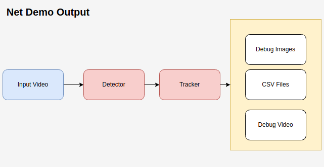

# People-Counting
**Author(s):**
* Tho Cao

**Status:** Implementing

### Goals
This codebase provides the experiment configs, analytics scripts to test and evaluate models for counting people, as well export result to another format (e.g. debug images, csv files)
### Report
[Doc Report](https://docs.google.com/document/d/1EiTHYLZ3Glm-0KqSXysIZBPLFRTlHXsQCsbUflOEVsQ/edit?usp=sharing)
### Installation
`conda` virtual environment is recommended. 
```
conda create -n people_counting python=3.9
conda activate people_counting
pip install -r requirements.txt
pip install -e .
```
**Problems with the OpenCV library for displaying images** [option]
1. Install dependencies:
```
sudo apt-get update
sudo apt-get install libgtk2.0-dev pkg-config
sudo apt-get install libgl1-mesa-glx
```
2. Uninstall the current Opencv
```
pip uninstall opencv-python
```
3. Reinstall OpenCV
```
pip install opencv-python
```
### Experiment Configuration
We use [Hydra](https://hydra.cc/) for managing experiment configs in hierachical and reuable fashion. 
#### Basic Concepts
This section includes specific details on how we use Hydra. For example, we define a configuration for evaluating the performance of multiple models by adding the model names that we want to evaluate and some basic configuration for input and output paths. Here is an example for **'eval_config.yaml'**
```yaml
defaults:
  - _self_
base_path: "./test_results"
ground_truth_csv: "ground_truth.csv"
output_csv: "output_metrics.csv"
model_names:
  - "yolov5n"
  - "yolov5s"
  - "yolov10x"
  - "yolov10n"()
```
#### Demo
* Run [colab demo](https://colab.research.google.com/drive/1s0N4sLrBQcTm7MYXuGjwRC9QlGCbpWz0?usp=sharing)

To run an experiment on a video, configure the **demo_config.yaml** for the Hydra settings:
```
python demo_net.py
```


To evaluate model performance, configure the **eval_config.yaml** for the Hydra settings:
```
python eval_net.py
```

#### Custom Training 
It is recommended to use the original tutorial.
```
yolo detect train data=coco.yaml model=yolov10n/s/m/b/l/x.yaml epochs=500 batch=256 imgsz=640 device=0,1,2,3,4,5,6,7
```
For detailed instructions on training with a custom dataset, please follow this guide. [How to Train YOLOv10 Object Detection on a Custom Dataset](https://github.com/roboflow/notebooks/blob/main/notebooks/train-yolov10-object-detection-on-custom-dataset.ipynb)

### Future Work

### References
* [YOLOv10: Real-Time End-to-End Object Detection (paper)](https://arxiv.org/abs/2405.14458)
* [YOLOv10: Source Code](https://github.com/THU-MIG/yolov10?tab=readme-ov-file)
* [YOLOv5: Source Code](https://github.com/ultralytics/yolov5)